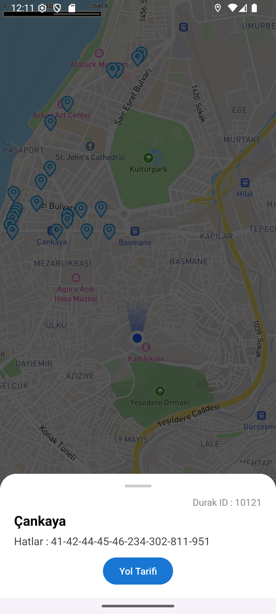
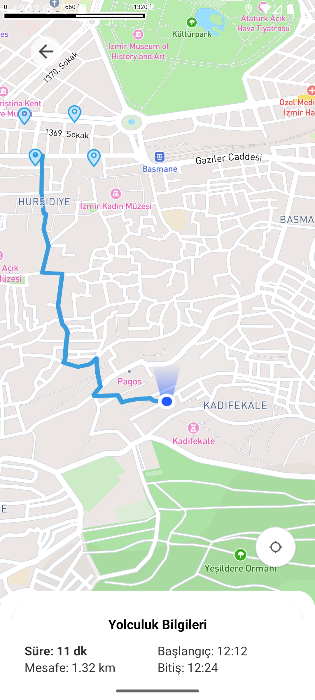

# 🧭 İzmirimKart Navigation App

This Android application is a public transit navigation solution built with **Kotlin** and **Mapbox Maps SDK**. It displays bus stops in İzmir, Turkey, and provides walking directions from the user's current location to a selected stop. It utilizes real-time location, a bottom sheet UI, and Mapbox routing.

---

## 📱 Features

- 📍 Display nearby bus stops from **İzmir Open Data API**
- 🗺️ Interactive Map powered by **Mapbox**
- 🧭 Real-time **user location tracking**
- 🚶 Route navigation from user location to selected bus stop
- 🧾 Route summary including:
  - Duration
  - Distance
  - Estimated arrival time
- 🧊 Bottom sheet interface for bus stop and route details
- 🔐 Location permission management

---

## 📸 Screenshots

<p align="center">
  
  &nbsp;&nbsp;
  
</p>

---

## ⚙️ Tech Stack

| Layer         | Technology                        |
|--------------|------------------------------------|
| Language      | Kotlin                             |
| Architecture  | MVVM + Coroutines                  |
| Map           | Mapbox Maps SDK                    |
| Networking    | Retrofit + Gson                    |
| UI            | Material Components + ViewBinding |
| API Source    | [Biz İzmir Open Data Portal](https://acikveri.bizizmir.com/) |

---

## 🧩 Architecture Overview

```
View (MainActivity)
│
├── ViewModel (BusStopViewModel)
│
├── Map Manager (MapManager)
│
├── Bus Stop Renderer (BusStopRenderer)
│
├── Directions Logic (DirectionsManager)
│
└── Data (RetrofitClient, DurakAPI)
```

---

## 🛠️ Installation & Setup

1. **Clone the Repository**
   ```bash
   git clone https://github.com/yourusername/izmirimkart-navigation.git
   cd izmirimkart-navigation
   ```

2. **Open with Android Studio**

3. **Set up your API Key**
   - Get a [Mapbox Access Token](https://account.mapbox.com/access-tokens/)
   - Add it to `res/values/strings.xml`:
     ```xml
     <string name="mapbox_access_token">YOUR_ACCESS_TOKEN_HERE</string>
     ```

4. **Set `RESOURCE_ID`**
   - In `BusStopViewModel.kt`, replace:
     ```kotlin
     val RESOURCE_ID = ""
     ```
     with the actual **resource ID** from the [İzmir Open Data Portal](https://acikveri.bizizmir.com/).

5. **Run on Emulator or Device**

---

## 🧪 Project Modules

### 📂 model/DuraklarModel.kt
Data model classes to map bus stop data from the API.

### 📂 services/
- `DurakAPI.kt` - Retrofit interface for API requests.
- `RetrofitClient.kt` - Singleton client instance with base URL.

### 📂 UI/
- `MainActivity.kt` - Initializes map, permissions, and UI interactions.
- `MapManager.kt` - Manages user location, camera, and route clearing.
- `BusStopRenderer.kt` - Displays bus stops on the map and handles click interactions.
- `DirectionsManager.kt` - Fetches and draws the walking route on the map.
- `PermissionManager.kt` - Handles runtime location permission requests.

### 📂 ViewModel/
- `BusStopViewModel.kt` - Loads and exposes bus stop data using Kotlin `StateFlow`.

---

## 🔐 Permissions

The following permissions are required for location tracking and internet access:

```xml
<uses-permission android:name="android.permission.ACCESS_COARSE_LOCATION" />
<uses-permission android:name="android.permission.ACCESS_FINE_LOCATION" />
<uses-permission android:name="android.permission.INTERNET" />
```

---

## 🚦 Usage Flow

1. App requests location permissions.
2. Map is initialized and user location is shown.
3. Bus stops are fetched and displayed as markers.
4. Tapping a marker shows a bottom sheet with stop details.
5. Clicking “Navigate” calculates and draws a walking route.
6. Route details are shown in a separate bottom sheet.
7. User can exit route mode via the “Exit” button.

---

## 📄 License

This project is licensed under the Apache 2.0 License. See the [LICENSE](LICENSE) file for details.

---

## 🙏 Acknowledgements

- Map data from [Mapbox](https://www.mapbox.com/)
- Public transport data via [Biz İzmir Açık Veri Portalı](https://acikveri.bizizmir.com/)

---

## 👨‍💻 Developer

**Kerem Levent**  
📧 [keremleventt@gmail.com](mailto:keremleventt@gmail.com)  
🔗 [LinkedIn Profile](https://www.linkedin.com/in/keremlevent/)
